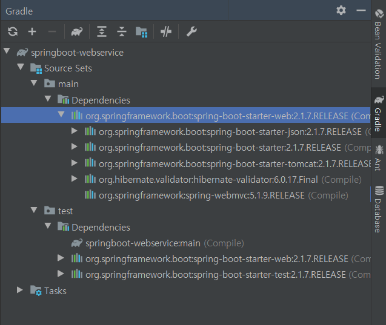

### 1.1 인텔리제이 소개

- 인텔리제이의 장점
    - 강력한 추천기능
    - 다양한 리팩토링과 디버깅 기능
    - 이클립스의 깃에 비해 높은 자유도
    - 프로젝트 시작할 때 인덱싱을 하여 파일을 비롯한 자원들에 대한 빠른 검색 속도
    - HTML,CSS,JS,XML 에 대한 강력한 기능 지원
    - 빠른 업데이트
    
### 1.2 인텔리제이 설치하기

- Ultimate 버전 사용 중이므로 pass

### 1.3 인텔리제이에서 프로젝트 생성하기

- 인텔리제이에는 **프로젝트, 모듈**의 개념이 존재
- [Create New Project] -> 그레이들 프로젝트 선택 -> Group ID, Artifact ID 설정 

### 1.4 그레이들 프로젝트를 스프링부트 프로젝트로 변경하기

- gradle 버전 4.x로 변경


- `build.gradle` 파일에 코드 추가

``` gradle
buildscript { //플러그인 의존성 관리
    ext { // 전역변수 설정
        springBootVersion = '2.1.7.RELEASE'
    }
    repositories {
        mavenCentral()
        jcenter() //mavenCentral 보다 간단한 라이브러리 업로드가 가능한 저장소
    }
    dependencies {
        classpath("org.springframework.boot:spring-boot-gradle-plugin:${springBootVersion}")
    }
}

apply plugin: 'java'
apply plugin: 'eclipse'
apply plugin: 'org.springframework.boot'
apply plugin: 'io.spring.dependency-management'//spring-boot 의존성 관리-> 반드시 추가

group 'com.kwonsye.spring-boot'
version '1.0-SNAPSHOT'

sourceCompatibility = 1.8

repositories { //가져올 라이브러리 저장소
    mavenCentral()
    jcenter()
}

dependencies { //사용할 의존성
    compile("org.springframework.boot:spring-boot-starter-web")
    testCompile("org.springframework.boot:spring-boot-starter-test")
}

```
- `build.gradle` sync




### 1.5 인텔리제이에서 깃과 깃허브 사용하기

- gitignore 설정
    - `.ignore` plugin 설치 -> 인텔리제이 재시작
    - 프로젝트에 `.gitignore` 파일 생성
    ```
    .gradle
    .build
    ```
- 소스트리를 이용해 로컬 프로젝트, github remote 저장소 연결함
