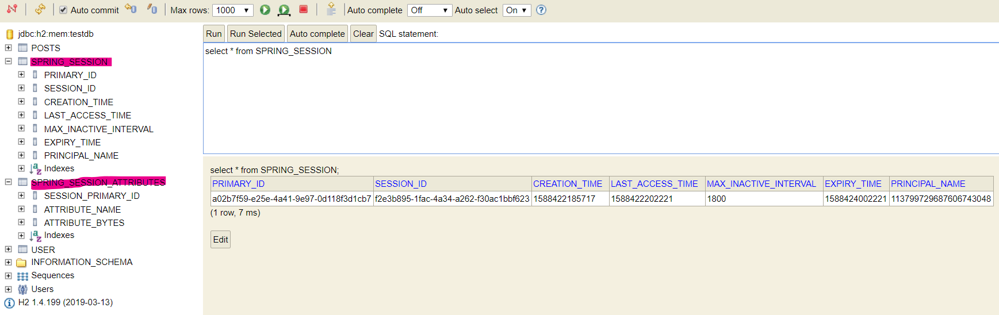
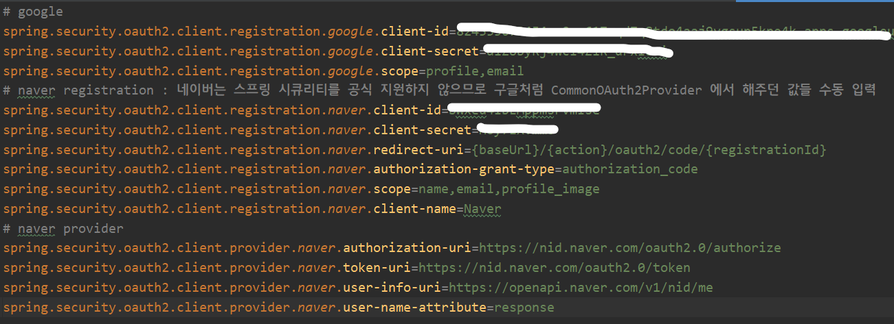
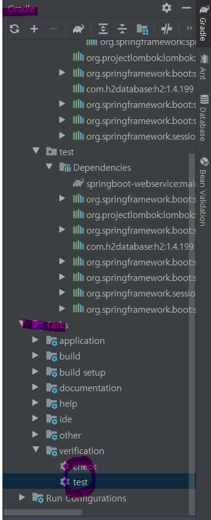

- 스프링 시큐리티
    - 막강한 인증과 인가
    - 스프링 애플리케이션의 보안 표준

### 5.1 스프링 시큐리티와 스프링 시큐리티 OAuth2 클라이언트

- 스프링부트 1.5 vs 스프링부트 2.0
    - `spring-security-oauth2-autoconfigure` 라이브러리 덕분에 2.0에서도 설정 방법이 크게 차이가 없음
    - 2.0에서는 `CommonOAuth2Provider`에서 enum으로 구글,깃허브,페이브북,옥타의 기본 설정값을 제공해줌. (네이버,카카오 등의 다른 소셜 로그인을 추가한다면 직접 설정 추가해야함)

### 5.2 구글 서비스 등록

- https://console.cloud.google.com/ -> [프로젝트 선택] -> [새 프로젝트] -> [만들기] -> [API 및 서비스] -> [사용자 인증 정보] -> [OAuth 클라이언트 ID 로 사용자 인증 정보 만들기] -> [OAuth 동의 화면] -> [User Type '외부' 만들기]
    
- 동의 화면 입력 -> [OAuth 클라이언트 ID 만들기 : 웹 애플리케이션 체크] -> [승인된 리디렉션 URI 에 `http://localhost:8080/login/oauth2/code/google` 입력]

- 승인된 리디렉션 URI
    - 인증이 성공하면 리다이렉트한 URL
    - 스프링부트2의 시큐리티에서는 기본적으로 `{도메인}/login/oauth2/code/{소셜서비스코드}`로 리다이렉트 URL을 지원(이미 구현되어있음)
    - 실제 서버에 배포하려면 localhost 외에 추가로 주소를 추가해야함

- 클라이언트 ID, 클라이언트 Secret 설정
    - `src/main/resources/application-oauth.properties` 생성
    ```properties
    spring.security.oauth2.client.registration.google.client-id=클라이언트 ID
    spring.security.oauth2.client.registration.google.client-secret=클라이언트 Secret
    spring.security.oauth2.client.registration.google.scope=profile,email
    ```
    - scope를 지정해주는 이유
        - 명시하지 않아도 scope의 기본값은 `openid,profile,email`
        - OpenId Provider인 서비스(구글)와 그렇지않은 서비스(네이버,카카오)로 나눠서 따로 `OAuth2Service`를 만들지 않기 위해서 scope를 profile,email로만 설정해줌
    
    - 클라이언트 ID, 클라이언트 Secret이 깃허브에 올라가지 않도록 `.gitignore`에 `application-oauth.properties` 추가

    - `application.properties`에 `application-oauth.properties`의 설정을 가져오기 위해 `spring.profiles.include=oauth` 추가

        - `application-xxx.properties`라면 xxx라는 이름의 profile이 생성됨. profile = xxx라는 식으로 호출하면 해당 properties의 설정을 가져올 수 있음

<br>

### 5.3 구글 로그인 연동하기

- 사용자 도메인을 위해 `{package}/domain/user/User`생성
```java
@Getter
@NoArgsConstructor
@Entity
public class User extends BaseTimeEntity {

    @Id
    @GeneratedValue(strategy = GenerationType.IDENTITY)
    private Long id;

    @Column(nullable = false)
    private String name;

    @Column(nullable = false)
    private String email;

    @Column
    private String picture;

    @Enumerated(EnumType.STRING) //emun 값을 String 으로 저장하는 필드
    @Column(nullable = false)
    private Role role; //사용자 권한

    @Builder
    public User(String name, String email, String picture, Role role){
        this.name=name;
        this.email = email;
        this.picture = picture;
        this.role = role;
    }

    public User update(String name, String picture){
        this.name=name;
        this.picture = picture;

        return this;
    }

    public String getRoleKey(){
        return this.role.getKey();
    }
}
```

- 사용자권한 emun `{package}/domian/user/Role` 생성
```java
@Getter
@RequiredArgsConstructor
public enum Role {

    GUEST("ROLE_GUEST", "손님"), //사용자 권한 코드에 항상 ROLE_이 앞에 붙어야함 key,title
    USER("ROLE_USER", "일반 사용자");

    private final String key;
    private final String title;
}
```

-  사용자 JPA를 위한 `{package}/domain/UserRepository` 생성
```java
public interface UserRepository extends JpaRepository<User,Long> {
    Optional<User> findByEmail(String email); //email을 통해 이미 생성된 사용자인지 처음 가입하는 사용자인지 판단
}
```

- 스프링 시큐리티 의존성 추가
    - `build.gradle`에 `compile('org.springframework.boot:spring-boot-starter-oauth2-client')` 추가
    - **spring-boot-starter-oauth2-client**
        - 클라이언트 입장에서 소셜 기능 구현시 필요
        - spring-security-oauth2-client 와 spring-security-oauth2-jose 관리

<br>

- 스프링 시큐리티 관련 패키지 `{package}/config/auth` 생성
    
- [스프링 시큐리티의 첫 설정단계] `{package}/config/auth/SecurityConfig` 생성
```java
@RequiredArgsConstructor
@EnableWebSecurity //Spring Security 설정 활성화시킴
public class SecurityConfig extends WebSecurityConfigurerAdapter {

    private final CustomOAuth2UserService customOAuth2UserService;

    @Override
    protected void configure(HttpSecurity http) throws Exception{
        http
                .csrf().disable()
                .headers().frameOptions().disable() //h2-console 화면을 사용하기 위해 해당 옵션 disable
                .and()
                    .authorizeRequests()//URL별 권한 관리를 설정하는 옵션의 시작점
                    .antMatchers("/","/css/**","/images/**","/js/**","/h2-console/**").permitAll() //전체 열람권한
                    .antMatchers("/api/v1/**").hasRole(Role.USER.name()) //USER 권한있는 사람만 접근가능
                    .anyRequest().authenticated() //설정값 이외 나머지 URL 도 인증된 사용자에게만 접근 허용
                .and()
                    .logout() //스프링 시큐리티 로그아웃 url /logout 기본제공
                        .logoutSuccessUrl("/") //로그아웃 성공시 rediret url
                .and()
                    .oauth2Login() //oauth2 로그인 기능에 대한 진입점
                        .userInfoEndpoint() //oauth2 로그인 이후 사용자 정보를 가져올때의 설정
                            .userService(customOAuth2UserService); //로그인 성공시 리소스 서버에서 user 정보가져와서 추가로 진행하고자하는 기능
    }
}    
```

- [로그인 성공시 User 정보를 이용해 추가로 진행하고자하는 서비스] `{package}/config/auth/CustomOAuth2UserService` 생성
```java
@RequiredArgsConstructor
@Service
public class CustomOAuth2UserService implements OAuth2UserService<OAuth2UserRequest, OAuth2User> {

    private final UserRepository userRepository;
    private final HttpSession httpSession;

    @Override
    public OAuth2User loadUser(OAuth2UserRequest userRequest) throws OAuth2AuthenticationException {

        OAuth2UserService delegate = new DefaultOAuth2UserService();
        OAuth2User oAuth2User = delegate.loadUser(userRequest);

        String registrationId = userRequest.getClientRegistration().getRegistrationId(); //로그인 진행 중인 서비스 아이디
        String userNameAttributeName = userRequest.getClientRegistration().getProviderDetails()
                                                    .getUserInfoEndpoint().getUserNameAttributeName(); //로그인 진행시 PK가 되는 필드값

        OAuthAttributes attributes = OAuthAttributes.of(registrationId, userNameAttributeName, oAuth2User.getAttributes()); //OAuth2UserService 를 통해 가져온 user attributes

        User user = saveOrUpdate(attributes); //User로 저장
        httpSession.setAttribute("user", new SessionUser(user)); //직렬화된 user 정보를 session 에 저장

        return new DefaultOAuth2User(
                Collections.singleton(new SimpleGrantedAuthority(user.getRoleKey())),
                attributes.getAttributes(),
                attributes.getNameAttributeKey());
    }

    private User saveOrUpdate(OAuthAttributes attributes) {
        User user = userRepository.findByEmail(attributes.getEmail())
                .map(entity -> entity.update(attributes.getName(), attributes.getPicture()))
                .orElse(attributes.toEntity());

        return userRepository.save(user);
    }
}
```

- [로그인 후 user의 attributes를 담는] `{package}/config/auth/dto/OAuthAttributes` 생성

```java
@Getter
public class OAuthAttributes {
    private Map<String,Object> attributes;
    private String nameAttributeKey;
    private String name;
    private String email;
    private String picture;

    @Builder
    public OAuthAttributes(Map<String,Object> attributes, String nameAttributeKey, String name, String email
    , String picture){
        this.attributes = attributes;
        this.nameAttributeKey = nameAttributeKey;
        this.name = name;
        this.email = email;
        this.picture = picture;
    }
    
    //map에 담긴 attributes를 뽑아내어 OAuthAttributes 객체에 담음
    public static OAuthAttributes of(String registrationId, String userNameAttributeName, Map<String,Object> attributes){
        return ofGoogle(userNameAttributeName, attributes);
    }

    private static OAuthAttributes ofGoogle(String userNameAttributeName, Map<String, Object> attributes) {
        return OAuthAttributes.builder()
                .name((String) attributes.get("name"))
                .email((String) attributes.get("email"))
                .picture((String)attributes.get("picture"))
                .attributes(attributes)
                .nameAttributeKey(userNameAttributeName)
                .build();
    }

    //해당 attributes 를 가진 User 반환
    public User toEntity(){
        return User.builder()
                .name(name)
                .email(email)
                .picture(picture)
                .role(Role.GUEST)
                .build();
    }
}

```

- [로그인 된 user 정보를 직렬화해서 session에 담는] `{package}/config/auth/dto/SessionUser` 생성

```java
@Getter
public class SessionUser implements Serializable { //인증된 사용자 정보 직렬화
    private String name;
    private String email;
    private String picture;

    public SessionUser(User user) {
        this.name=user.getName();
        this.email=user.getEmail();
        this.picture=user.getPicture();
    }
}
```

- `IndexController` 에 로그인 성공한 세션 유저의 정보 넘겨주는 코드 추가하기

```java
@RequiredArgsConstructor
@Controller
public class IndexController { //mustache url 매핑

    private final PostsService postsService;
    private final HttpSession httpSession;

    @GetMapping("/")
    public String index(Model model){
        model.addAttribute("posts", postsService.findAllDesc()); //데이터를 posts로 index.mustache에 전달
        SessionUser user = (SessionUser) httpSession.getAttribute("user"); //이미 로그인해서 세션에 존재하는 user가져옴

        if(user!=null){
            model.addAttribute("userName",user.getName()); //로그인했다면 userName 넘김
        }

        return "index"; //index.mustache 페이지 매핑
    }
    ...
}
```

<br>

### 5.4 어노테이션 기반으로 개선하기

- `IndexController`의 세션값을 가져오는 부분이 중복될 코드가 될 가능성이 높다.
`SessionUser user = (SessionUser) httpSession.getAttribute("user");`

- 메소드 인자로 세션값을 바로 받을 수 있도록 변경해보자!

- @LoginUser 어노테이션을 만들기 위한 `{package}/config/auth/@interface LoginUser` 생성

```java
@Target(ElementType.PARAMETER) //annotation 이 적용될 위치, PARAMETER : 메소드의 파라미터로 선언된 객체 앞에만 붙일 수 있음
@Retention(RetentionPolicy.RUNTIME) //자바 컴파일러가 어노테이션을 다루는 방법: 특정 시점까지 영향을 미치는지를 결정, RetentionPolicy.RUNTIME의 경우 컴파일 이후에도 JVM에 의해 계속 참조가 가능
public @interface LoginUser {
    //@LoginUser 를 붙이면 세션에서 user정보를 주입할 것임
}
```

- @LoginUser 어노테이션이 붙을 경우 넘길 객체에 대한 설정을 위한 `{package}/config/auth/LoginUserArgumentResolver` 생성

```java
@RequiredArgsConstructor
@Component //component 스캔으로 bean으로 만들기
public class LoginUserArgumentResolver implements HandlerMethodArgumentResolver {//조건에 맞는 메소드가 있다면 지정한 값으로 메소드의 파라미터로 넘길 수 있다.

    private final HttpSession httpSession;

    @Override
    public boolean supportsParameter(MethodParameter parameter) {
        //컨트롤러 메소드의 어떤 파라미터를 지원하는지 판단

        boolean isLoginUserAnnotation = parameter.getParameterAnnotation(LoginUser.class) != null; // 파라미터에 @LoginUser가 붙어있는지
        boolean isUserClass = SessionUser.class.equals(parameter.getParameterType()); // 파라미터 클래스 타입이 SessionUser 인지

        return isLoginUserAnnotation && isUserClass;
    }

    @Override
    public Object resolveArgument(MethodParameter parameter, ModelAndViewContainer mavContainer, NativeWebRequest webRequest, WebDataBinderFactory binderFactory) throws Exception {
        //supportsParameter()==true 일 경우 파라미터에 전달할 객체

        return httpSession.getAttribute("user");
    }
}
```

- `HandlerMethodArgumentResolver` 를 설정에 등록하기 위한 `{package}/config/WebConfig` 생성

```java
@RequiredArgsConstructor
@Configuration
public class WebConfig implements WebMvcConfigurer {//HandlerMethodArgumentResolver를 스프링에서 인식시키기 위해 등록

    private final LoginUserArgumentResolver loginUserArgumentResolver;

    @Override //default 메소드이므로 원할때만 오버라이드
    public void addArgumentResolvers(List<HandlerMethodArgumentResolver> resolvers) {
        resolvers.add(loginUserArgumentResolver);
    }
}
```

<br>

### 5.5 세션 저장소로 데이터베이스 사용하기

- 현재는 애플리케이션을 재실행하면 내장 톰캣(WAS) 메모리가 초기화되면서 세션도 초기화됨.

- 세션 저장소에 대한 선택지
    1. 톰캣 세션 사용
        - 기본 설정
        - 톰캣에 세션이 저장되므로 2대 이상의 WAS가 구동된다면 톰캣들 간의 세션을 공유를 위한 추가 설정이 필요

    2. 데이터베이스를 세션 저장소로 사용
        - 여러 WAS 간의 공용 세션을 사용할 수 있는 가장 쉬운 방법
        - 설정 간단
        - 로그인 요청마다 DB IO가 발생해서 성능상 이유가 발생할 수 있음
        - 로그인 요청이 많이 없는 백오피스, 사내 시스템 용도에서 사용

    3. 메모리 DB(ex Redis)를 세션 저장소로 사용
        - 인 메모리 DB란 디스크가 아니라 메인 메모리에 db를 저장하는 것. 빠른것이 장점
        - B2C에서 많이 사용
        - 실제 서비스로 사용하기 위해서는 외부 메모리 서버가 필요
        

-  **데이터베이스를 세션 저장소**로 사용해보자

- `build.gradle`에 spring-session-jdbc 의존성 등록
```gradle
compile('org.springframework.session:spring-session-jdbc')
```

- `application.properties`에 세션 저장소 설정 추가
```properties
spring.session.store-type=jdbc
```
- 재실행 후 로그인하면 JPA로 인해 자동으로 `SPRING_SESSION`, `SPRING_SESSION_ATTRIBUTES` 테이블이 생성됨.



### 5.6 네이버 로그인

- [네이버 오픈 API](https://developers.naver.com/apps/#/register) 로 이동 -> [애플리케이션 이름 등록]->[사용 API 네아로 선택] -> [서비스 URL `http://localhost:8080/` 등록] ->[네아로 Callback URL `http://localhost:8080/login/oauth2/code/naver` 등록]

- `application-oauth.properties` 에 registration 관련 설정과 provider 설정 추가



- `OAuthAttributes` 파일에 네이버 설정 추가
```java
@Getter
public class OAuthAttributes {
    private Map<String,Object> attributes;
    private String nameAttributeKey;
    private String name;
    private String email;
    private String picture;

    ...

    //map에 담긴 attributes를 뽑아내어 OAuthAttributes 객체에 담음
    public static OAuthAttributes of(String registrationId, String userNameAttributeName, Map<String,Object> attributes){
        if("naver".equals(registrationId)){
            return ofNaver("id",attributes);
        }

        return ofGoogle(userNameAttributeName, attributes);
    }

    private static OAuthAttributes ofNaver(String userNameAttributeName, Map<String, Object> attributes) {
        Map<String,Object> response = (Map<String, Object>) attributes.get("response"); //네이버로 로그인 성공시 response key로 user attribute 정보 내려줌

        return OAuthAttributes.builder()
                .name((String) response.get("name"))
                .email((String)response.get("email"))
                .picture((String) response.get("profile_image"))
                .attributes(response)
                .nameAttributeKey(userNameAttributeName)
                .build();
    }
    ...
}
```

### 5.7 기존 테스트에 시큐리티 적용하기

- 모든 API 호출은 인증된 사용자만 가능하도록 설정했다.
- 기존의 API 테스트 코드들이 모두 인증 권한을 받지 못했으므로, 테스트 코드마다 인증한 사용자가 호출한 것처럼 작동하도록 수정하자!

- 전체 테스트 실행


<br>

#### 스프링 시큐리티 적용으로 깨진 테스트 수정하기

- 소셜로그인 관련 설정값이 없는 에러
    
    - `src/test`에 `application.properties` 가 없으면 `src/main`의 `application.properties`설정을 가져옴.
        - but `application-oauth.properties` 파일을 가져오지는 않음

    -  `src/test/resources/application.properties`생성

    

- 테스트 시 임의로 인증된 사용자 권한 주기 
    
1. 스프링 시큐리티 테스트를 위한 도구인 `spring-security-test`를 `build.gradle`에 추가
```gradle
testCompile("org.springframework.security:spring-security-test") //스프링 시큐리티 테스트를 위해 임의의 사용자 인증을 추가하기 위함
```

2. `PostApiControllerTest`에 인증된 mock 사용자 설정 및 mock mvc 로 api test 변경하기
    
```java
@RunWith(SpringRunner.class)
@SpringBootTest(webEnvironment = SpringBootTest.WebEnvironment.RANDOM_PORT)
public class PostsApiControllerTest {

    ...

    @Autowired
    private WebApplicationContext context;

    private MockMvc mvc;

    @Before //모든 테스트 전에 mockmvc를 생성
    public void setup(){
        mvc = MockMvcBuilders
                .webAppContextSetup(context)
                .apply(springSecurity())
                .build();
    }

    ...

    @Test
    @WithMockUser(roles="USER") //테스트 시 임의의 사용자 인증 추가, 인증된 모의 사용자,ROLE_USER 권한을 가진 사용자가 API를 요청하는 것과 동일한 효과, MockMvc에서만 작동함
    public void registerPosts() throws Exception{
        //given
        ...

        //when
        //@MockUser 를 이용하기 위해 mock mvc 로 API 테스트
        mvc.perform(post(url)
                        .contentType(MediaType.APPLICATION_JSON_UTF8)
                        .content(new ObjectMapper().writeValueAsString(requestDto))) //Body는 json으로 변환
                .andExpect(status().isOk());
        //then
        List<Posts> all = postsRepository.findAll();
        assertThat(all.get(0).getTitle()).isEqualTo(title);
        assertThat(all.get(0).getContent()).isEqualTo(content);

    }

    @Test
    @WithMockUser(roles = "USER")
    public void updatePosts() throws Exception{
        //given
       ...

        //when
        //@MockUser 를 이용하기 위해 mock mvc 로 API 테스트
        mvc.perform(put(url)
                .contentType(MediaType.APPLICATION_JSON_UTF8)
                .content(new ObjectMapper().writeValueAsString(requestDto))) //Body 는 json으로 변환
                .andExpect(status().isOk()); 
        
        //then
        List<Posts> all = postsRepository.findAll();
        assertThat(all.get(0).getTitle()).isEqualTo(expectedTitle);
        assertThat(all.get(0).getContent()).isEqualTo(expectedContent);

    }
}    
```

3. `HelloControllerTest`의 스캔대상 변경
```java
@RunWith(SpringRunner.class)
@WebMvcTest(controllers = HelloController.class, 
        excludeFilters = { //@WebMvcTest는 @Repository, @Service, @Component 는 스캔대상 아님 -> SecurityConfig에서 사용하는 CustomOAuth2UserService 는 스캔못해서 에러남
            @ComponentScan.Filter(type = FilterType.ASSIGNABLE_TYPE,classes = SecurityConfig.class)  //따라서 스캔대상에서 제외
        }) 
public class HelloControllerTest {

    @WithMockUser(roles = "USER")
    @Test
    public void returnHello() throws Exception{...}

    @WithMockUser(roles = "USER")
    @Test
    public void returnHelloDto() throws Exception{...}
}
```

4. Jpa 기능이 없는 `@WebMvcTest`가 `Application`의 `@EnableJpaAuditing`을 스캔하는 문제
    - `Application`의 `@EnableJpaAuditing` 삭제
    - `{package}/config/JpaConfig` 생성
    ```java
    @Configuration
    @EnableJpaAuditing //@WebMvcTest 의 에러를 해결하기 위해 @SpringBootApplication과 분리
    public class JpaConfig {}
    ```